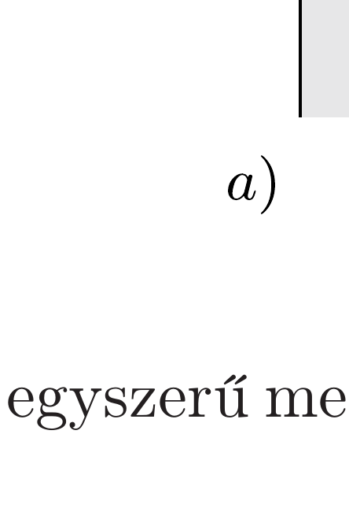
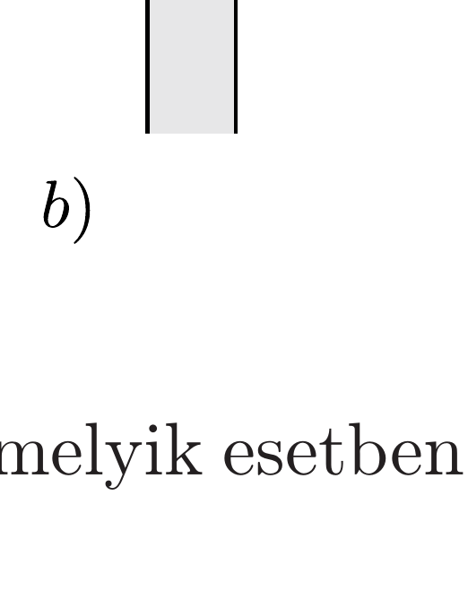

Egy habókos lakberendező állófogast tervez két változatban. Egy negyedkörív alakú, vékony, de erős rugalmas fémszálat egyik végénél szilárdan hozzáerősít egy merev törzshöz, egyszer az ábrán látható $a$ ), másszor a $b$ ) elrendezésben. Meglepődve tapasztalja, hogy ha ugyanakkora terhet akaszt a fogasokra, a fémszálak végpontja nem ugyanannyival süllyed le a két esetben.

Okoskodjuk ki egyszerú megfontolásokkal, hogy melyik esetben nagyobb a végpont lesüllyedése!
