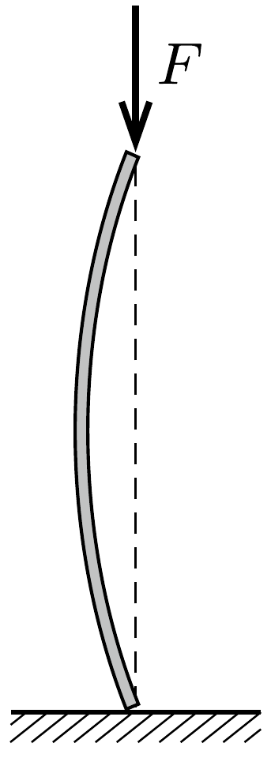

Egy bizonyos vastagságú és szakítószilárdságú kábelt szeretnénk egy hajóról függőlegesen lefelé a tengerbe lógatni, a kábel azonban 1 km-es hossznál a saját súlya alatt elszakad. Milyen hosszú kábellel érhető el a 3 km mély tengerfenék, ha szakaszonként több szál is futhat egymással párhuzamosan? Becsüljük meg, mennyi ká-

belre lenne szükség a 10000 m-es mélység eléréséhez. (A tengervíz súrúségét tekinthetjük állandónak, a kábelt pedig nyújthatatlannak.)
