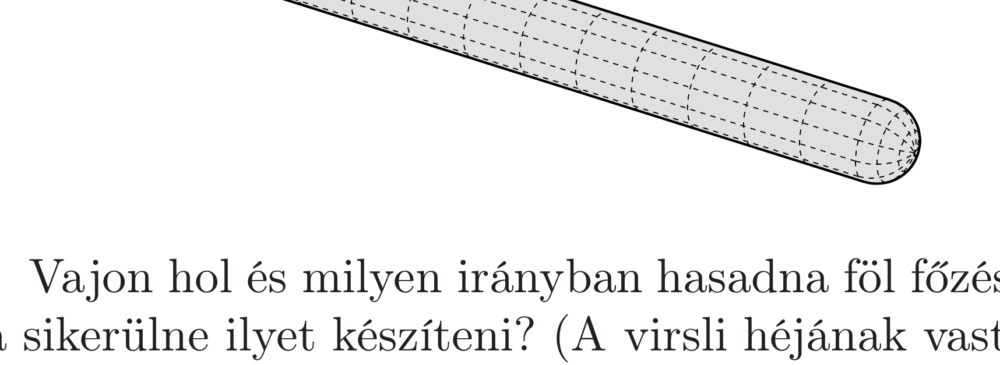
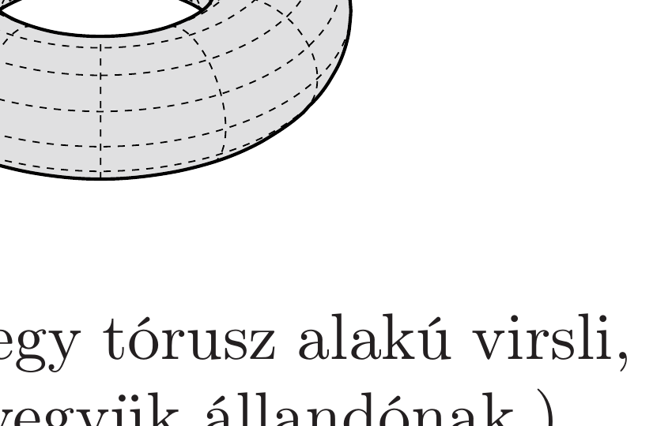
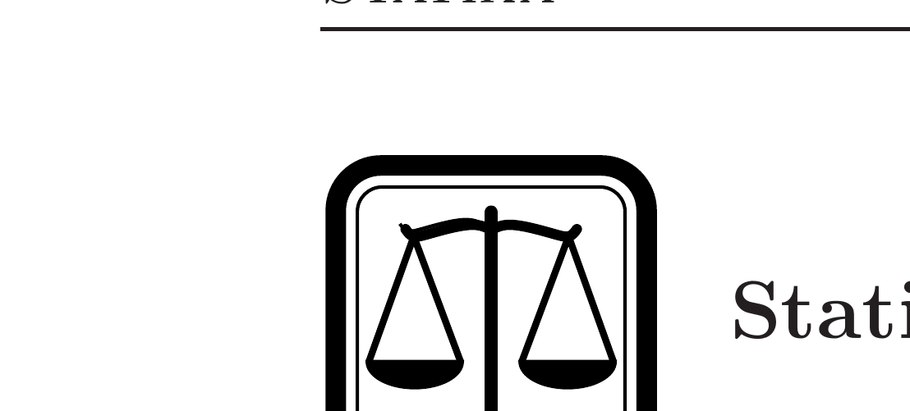

Mindennapi konyhai tapasztalat, hogy a frankfurti virsli (hosszú, egyenes, juhbeles virsli) főzés közben mindig „hosszában” hasad fel, sohasem „keresztben". Mi az oka ennek?

Vajon hol és milyen irányban hasadna föl főzés közben egy tórusz alakú virsli, ha sikerülne ilyet készíteni? (A virsli héjának vastagságát vegyük állandónak.)

