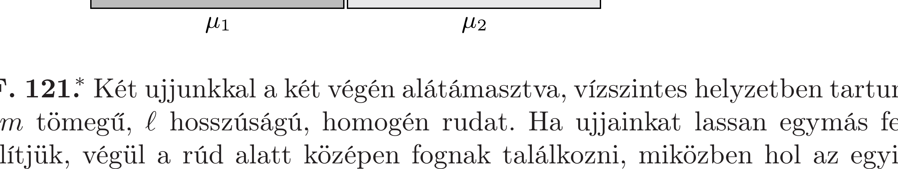

Egy zsáknyi homok vízszintes felületen egy szőnyegen fekszik. Az $M$ tömegú zsákot a szőnyeg segítségével lassan át akarjuk húzni egy viszonylag sima felületról egy érdesebb felületre. Mennyi munkát kell végeznünk, ha a felületek és a szőnyeg közötti súrlódási együttható $\mu_{1}$, illetve $\mu_{2}$ ? (A zsák súlya nem egyenletesen oszlik el a szőnyegen, de tudjuk, hogy a tömegközéppontja a széleitől $s_{1}$, illetve $s_{2}$ távolságban van.)

