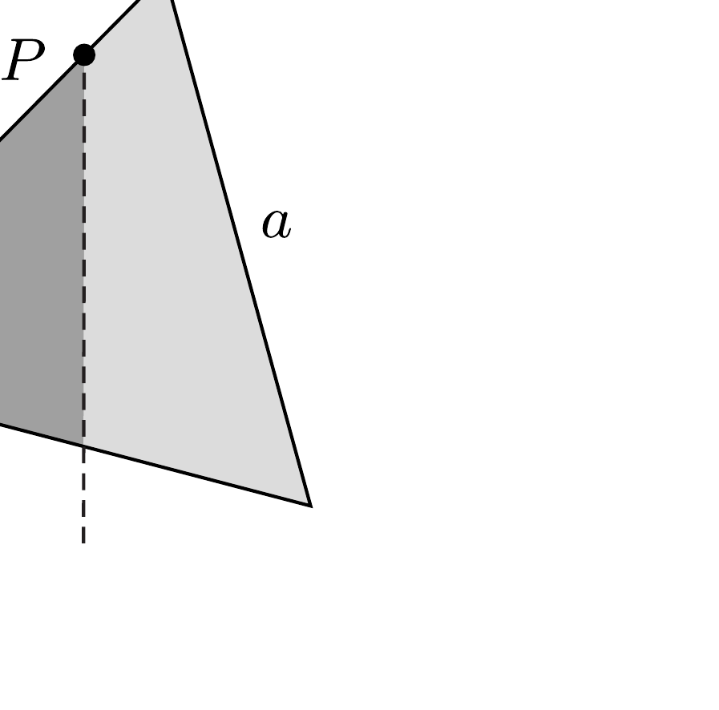
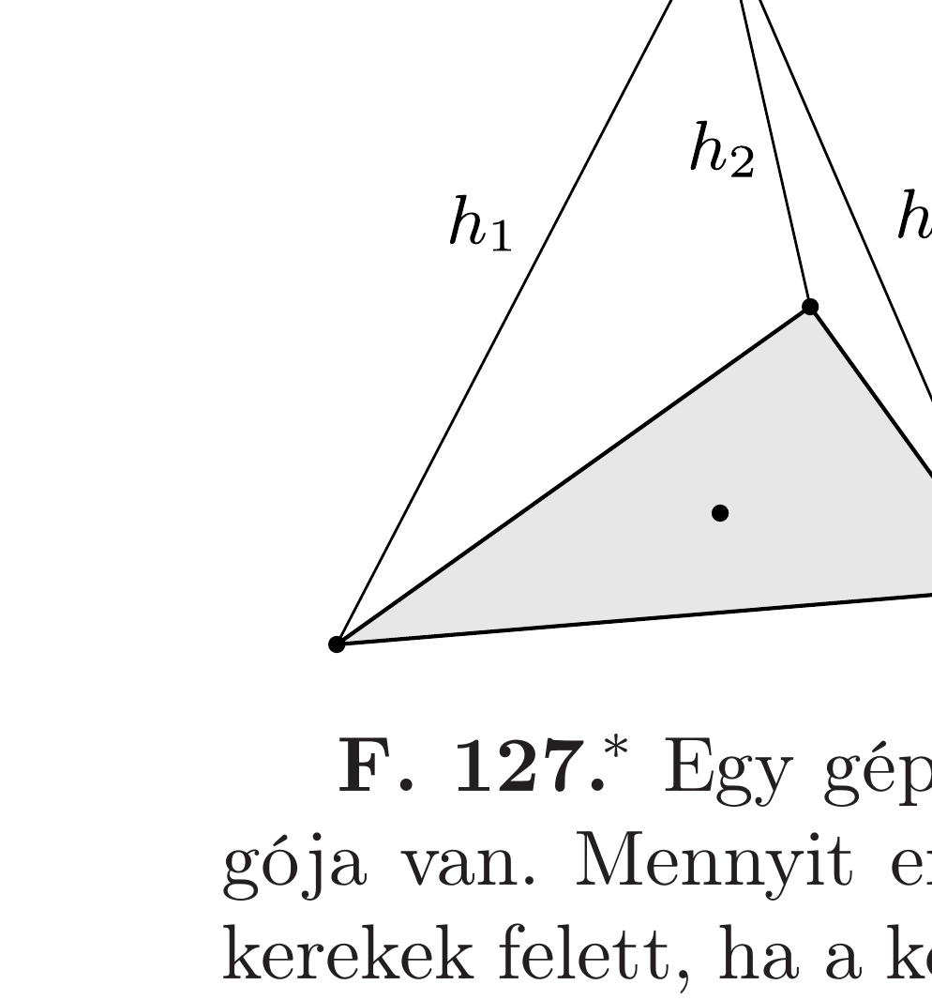

Homogén lemezbő́l egyenlő oldalú háromszöget vágunk ki. Ezt kerületének valamely $P$ pontjában felfüggesztjük. A $P$ pont és az egyik csúcs távolsága a háromszög oldalhosszának $x$-szerese.

A felfüggesztési ponton átmenó függőleges egyenes a háromszöget két részre osztja. Melyik felfüggesztési pontnál (azaz mekkora $x$ értéknél) lesz a két rész tömegének aránya a legnagyobb, és mekkora ez a maximális tömegarány?

