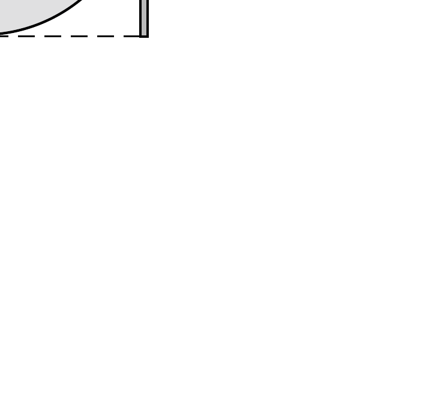

Középen derékszögben meghajlított lemezt egy vízszintes tengelyú, rögzített hengerre helyezünk az ábra szerint. A henger átmérője akkora, mint a lemez felének szélessége. Legalább mekkora a tapadási súrlódási együttható a henger és a lemez között, ha a lemez nem csúszik le a hengerról?

