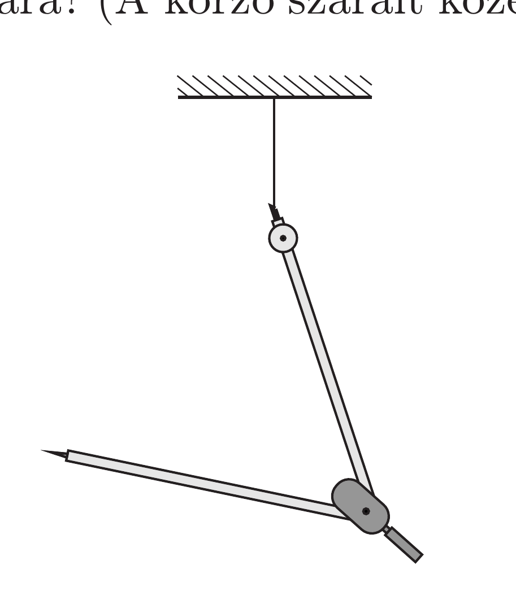

Egy körzőt az egyik végénél fogva felfüggesztünk egy fonálon. Milyen szögben kell kinyitni a körzőt, hogy csuklója a lehető legmagasabban legyen? Hogyan áll ekkor a körző alsó szára? (A körző szárait közelítsük homogén rudakkal.)

