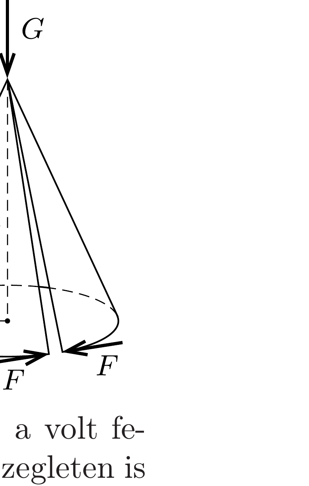

Körcikk alakú papírlapból $h$ magasságú, $r$ alapkörsugarú kúpot hajlítunk úgy, hogy a paláston a papírlap két egyenes határa majdnem összeér. A kúp ebben az állapotban belsó feszültségektől mentes.

A kúpot vízszintes, síkos lapra állítjuk, majd a csúcsában $G$ nagyságú függőleges eróvel megterheljük, anélkül, hogy összeroskadna. A kúp szétnyílását az alapkör kerületénél ható, érintő irányú $F$ erốvel tudjuk megakadályozni. Mekkora az $F$ eró? (A súrlódást és a papír hajlítási merevségét elhanyagolhatjuk.)

