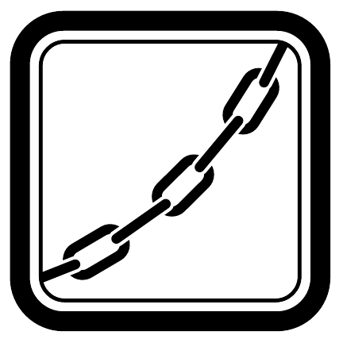

Készíthető-e olyan homogén tömegeloszlású tetraéder, amely vízszintes asztallapra állítva három oldallapjáról felborul, és csak egyetlen helyzetben lehet stabil?

\section*{Kötelek, láncok, granulált anyagok}
