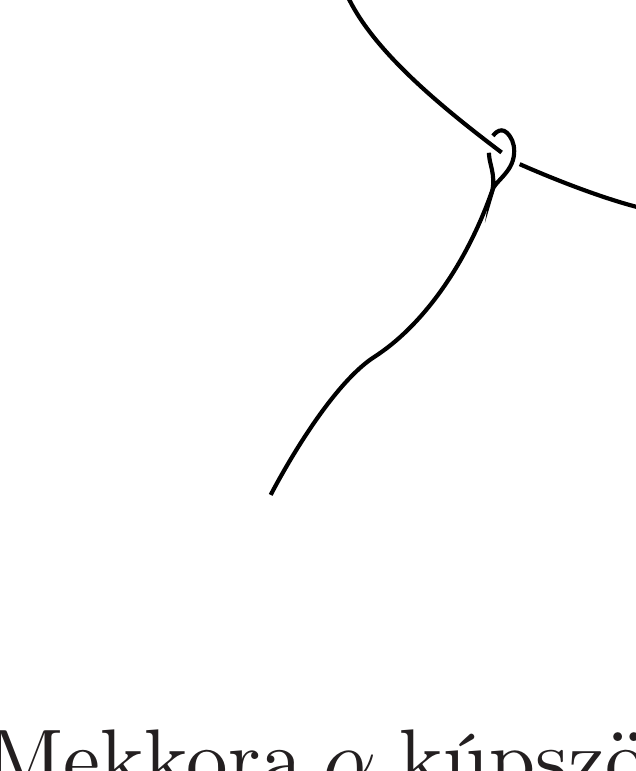
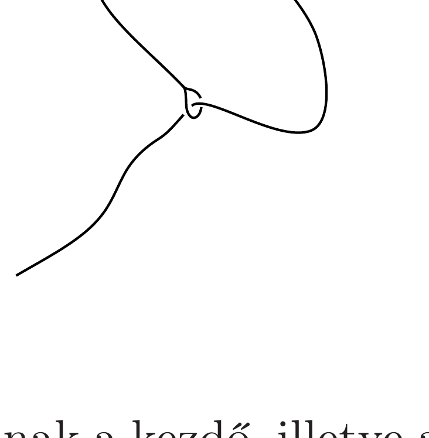
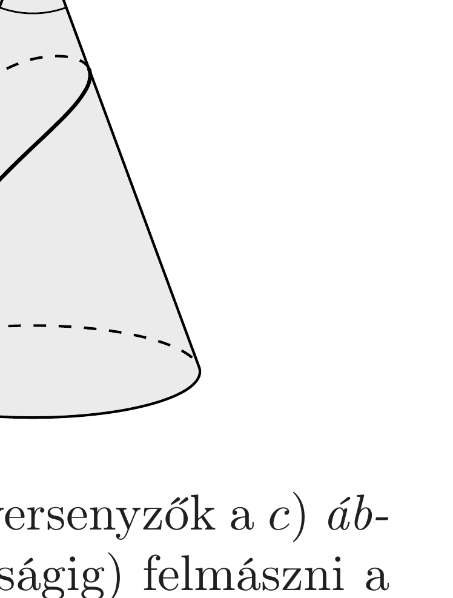

A jégfalmászás extrém sportjának megszállottjai egy újfajta versenyen mérik össze erejüket és ügyességüket. A versenyzőknek egy szabályos kúp alakú, nagyon sima, csúszós „jéghegyre” kell minél magasabbra felmászniuk, méghozzá „tiszta mászással”: sem hágóvasakat vagy jégcsákányt, sem pedig a jégfalba erósített kapaszkodókat nem használhatnak! Egyetlen segédeszközük egy lasszó lehet, amely a kezdőknél az $a$ ) ábrán látható módon két darabból áll, a haladók pedig a $b$ ) ábrán látható, egyetlen kötélből készül változatot használják. Mindkét lasszó kötele nagyon síkos, emiatt még a kis hurkoknál sem lép fel számottevő súrlódás.

Mekkora $\alpha$ kúpszög esetén tudnak a kezdő, illetve a haladó versenyzők a $c$ ) ábrán látható módon lasszójuk segítségével (valamekkora magasságig) felmászni a jéghegyre? (A versenyzők alacsonyak, emiatt a lasszó egyenes szára gyakorlatilag hozzásimul a jéghegyhez. A kötél tömege a versenyzők tömege mellett elhanyagolható.)
