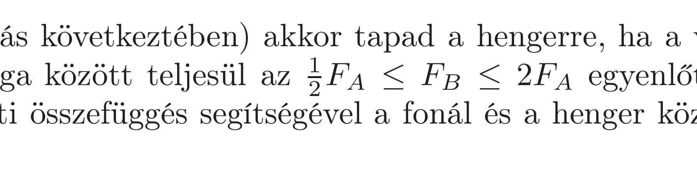

Egy rögzített henger kerületének felére az ábrán látható módon könnyü, nyújthatatlan fonalat feszítünk ki.

A fonál (a súrlódás következtében) akkor tapad a hengerre, ha a végpontjaiban ható erók nagysága között teljesül az $\frac{1}{2} F_{A} \leq F_{B} \leq 2 F_{A}$ egyenlőtlenség. Határozzuk meg a fenti összefüggés segítségével a fonál és a henger közötti súrlódási együtthatót!
