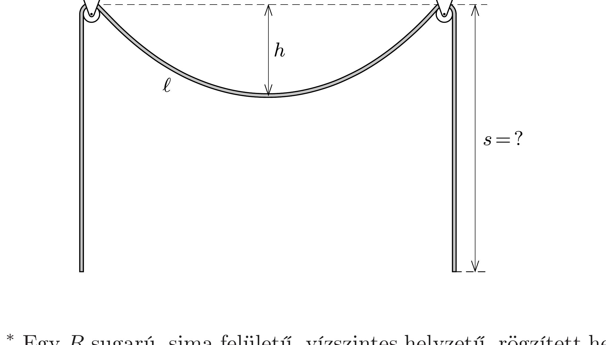

Egyenletes tömegeloszlású, hajlékony kötelet két, azonos magasságban rögzített, kicsiny állócsigára helyezünk az ábrán látható módon. Ekkor a kötél csigák közé eső darabjának hossza $\ell$, a „belógás” pedig $h$. Mekkora a kétoldalt lelógó kötéldarabok $s$ hossza?

