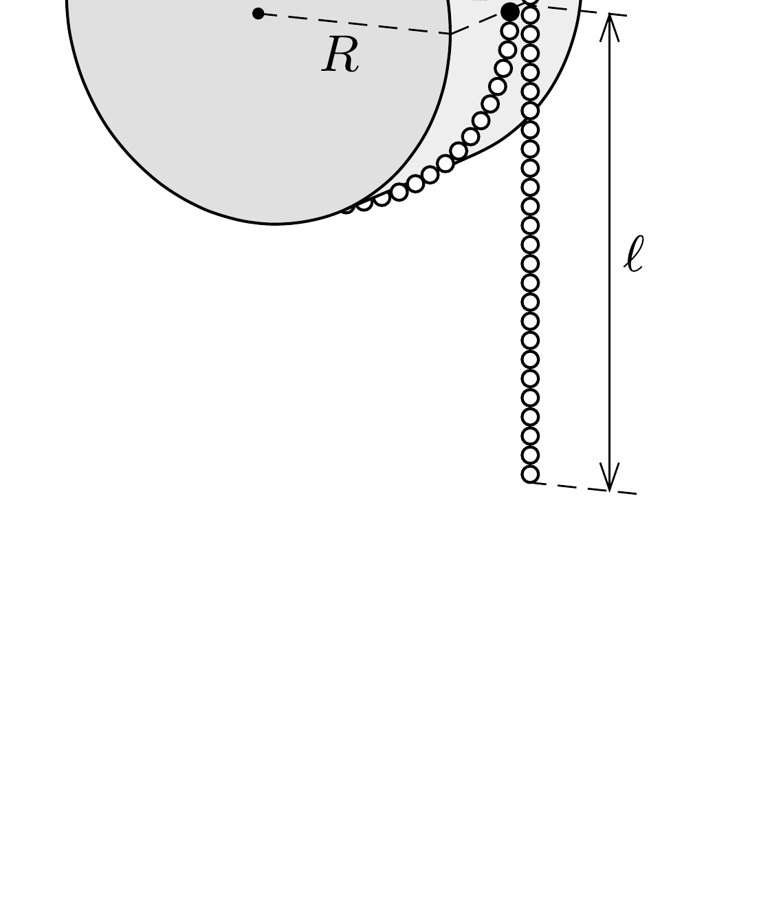

Egy $R$ sugarú, sima felületú, vízszintes helyzetü, rögzített hengerhez egy apró szemú gyöngysort kötünk úgy, hogy egyik végét a paláston, a henger tengelyével azonos magasságban lévő $P$ pontban rögzítjük, majd a gyöngysort egyszer átvetjük a hengeren. Legalább mekkora legyen a függőlegesen lelógó rész $\ell$ hossza, hogy a gyöngysor többi része mindenhol a henger palástjához simuljon?

