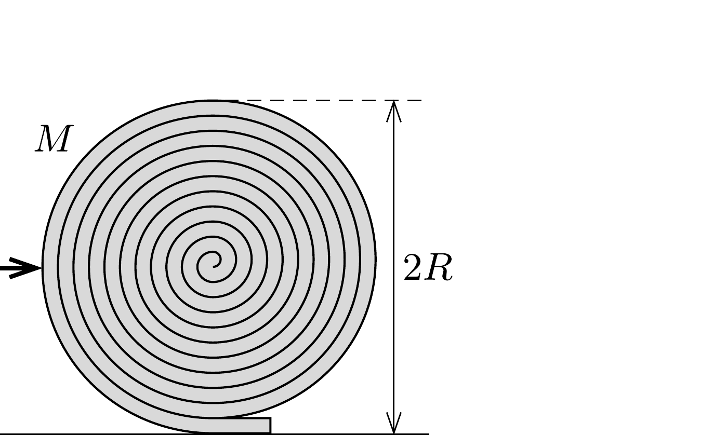

Egy $M$ tömegü, $L$ hosszúságú, hajlékony futószőnyeget szorosan felgöngyöltünk egy $R$ sugarú hengerré $(R \ll L)$. Ha a felgöngyölt szőnyeget elengedjük, az magától kitekeredik. (A gördülési ellenállás elhanyagolható.)
a) Milyen erőhatással magyarázható a jelenség?

b) Mekkora vízszintes eróvel akadályozható meg a szőnyeg kitekeredése?
