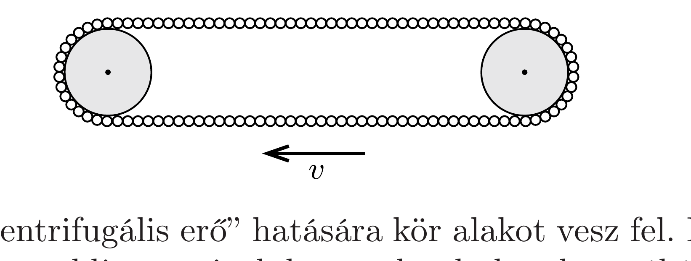

Egyenletes tömegeloszlású, hajlékony lánc két hengert összekötve feszesen forog, alakja a stadionok futópályájához hasonlóan két félkörből és két egyenes szakaszból áll.

Valamilyen ok miatt a lánc hirtelen lecsúszik a hengerekről, és függőlegesen szabadon esik. Vajon hogyan változik meg a lánc alakja esés közben?

Pisti szerint a „centrifugális erő“ hatására kör alakot vesz fel. Laci is elfogadja ezt az érvelést, de megtoldja annyival, hogy a kezdetben hosszúkás lánc a kör alakot elérve lendületből tovább deformálódik, az eredeti hossztengelyére merőleges irányban válik elnyújtottá, és ezt a mozgást megismételve „lüktetni” kezd. Feri arra tippel, hogy a lánc megtartja kezdeti formáját, de nem tudja megindokolni, hogy miért.

Vajon melyiküknek van igaza, vagy netán mindannyian tévednek?
