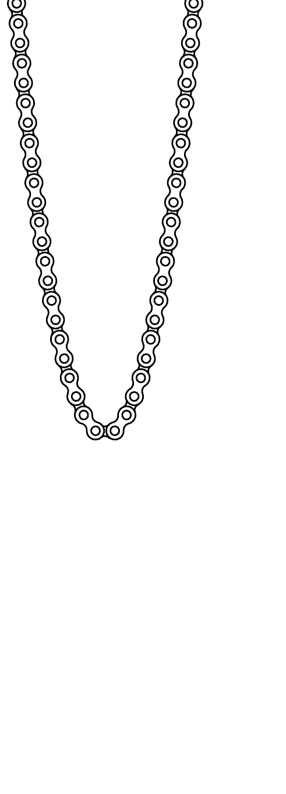

Egy fogaskerék tengelyét vízszintesen rögzítjük, és ráhelyezünk egy kerékpárláncot, majd a fogaskereket a tengelye körül óvatosan forgatni kezdjük. Milyen alakot vesz fel a lánc, amikor a fogaskerék már állandó szögsebességgel sebesen forog?

