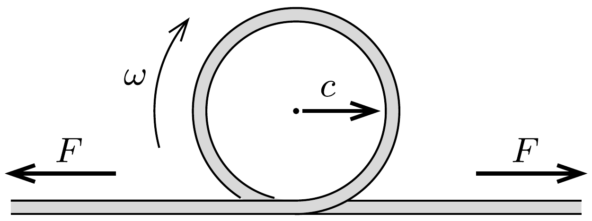

Egy hosszú, súlyos, hajlékony kötelet, amelynek hosszegységre esó tömege $\lambda$, állandó $F$ eróvel feszítünk. A kötél egyik végénél egy hirtelen mozdulattal kör alakú hurkot képezünk. A hurok - a transzverzális hullámokhoz hasonlóan - valamekkora $c$ sebességgel végigszalad, végiggördül a kötélen.

- a) Számítsuk ki a hurok $c$ sebességét!
- b) Határozzuk meg az $\omega$ körfrekvenciájú hurok által szállított energiát, impulzust (lendületet) és impulzusnyomatékot (perdületet)! Milyen kapcsolatban állnak ezek a mennyiségek egymással?
