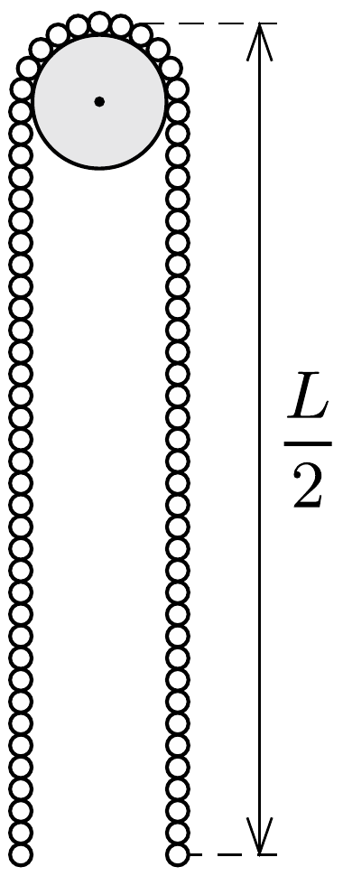

Egy rögzített tengelyú, kicsiny csigán majdnem pontosan szimmetrikusan egy $L$ hosszú, súlyos, hajlékony, nyújthatatlan láncot vetettünk át. A láncot ebbő̌l a helyzetéből kezdősebesség nélkül elengedjük.

A lánc melyik helyzetében válik el a csigától? Mekkora lesz ekkor a sebessége?

