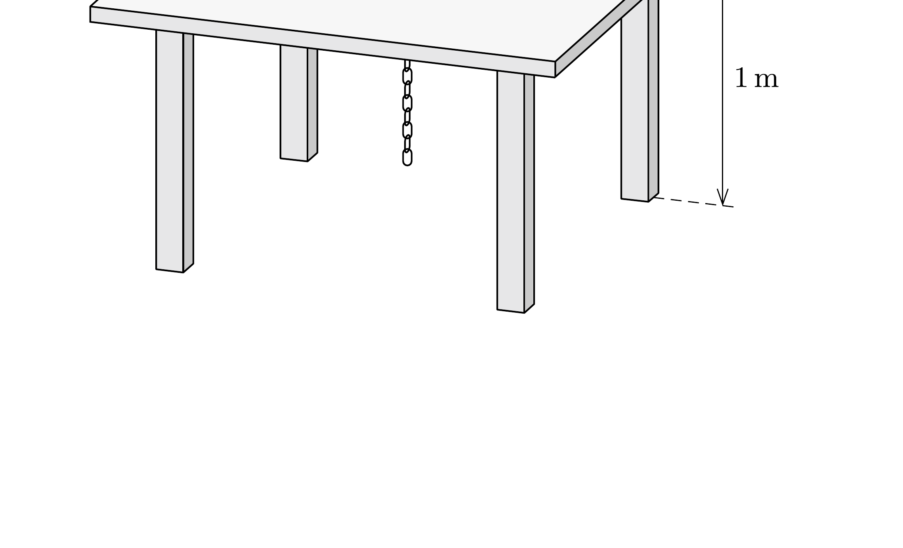

Egy 1 méter magas asztal lapjának közepén lyuk van. A lyuk közvetlen környezetében az asztallapon lazán elhelyeztünk egy 1 méter hosszú, vékony láncot. Ennek egyik végét a lyukon keresztül kicsit meghúzzuk, majd elengedjük. A lánc egyre növekvő sebességgel szalad le a lyukon át. (Feltételezhetjük, hogy a lánc nem gubancolódik össze. A súrlódás és a légellenállás elhanyagolható.)

Mennyi idő alatt ér a lánc egyik, illetve másik vége a földre?

