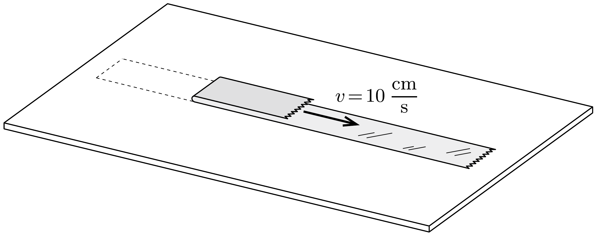

Egy asztallapra felragasztunk egy bizonyos hosszúságú celluxszalagot, majd az egyik végét felhajtva, vízszintesen 10 cm/s sebességgel egyenletesen visszafelé húzzuk. Mekkora sebességgel mozog a szalag mozgásban lévő részének a közepe?

