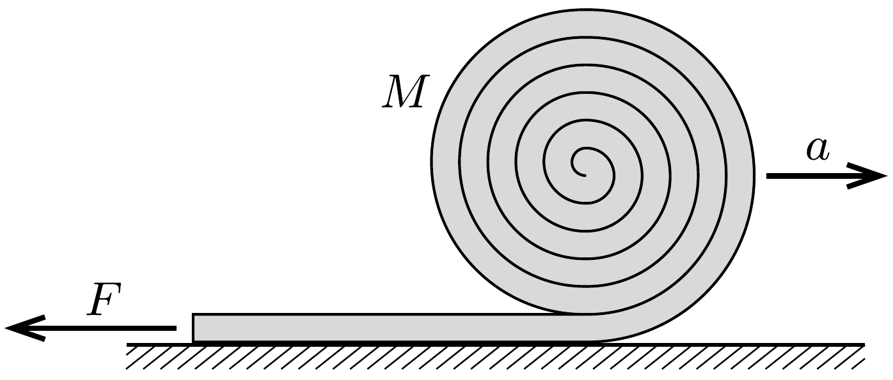

Egy $M$ tömegú, $L$ hosszúságú, hajlékony tüzoltófecskendőt $R$ sugarú gurigává tekerünk össze $(R \ll L)$. A tekercset vízszintes talajon $v_{0}$ kezdősebességgel ( $v_{0} / R$ szögsebességgel) elgurítjuk, miközben a cső végét a talajhoz szorítjuk. A fecskendő fokozatosan kitekeredik, egyre hosszabb része válik egyenessé.

a) Mennyi idő alatt tekeredik ki teljesen a fecskendő?
b) A guriga sebessége egyre nő, gyorsulása tehát a sebességével azonos irányú vektor. Ugyanakkor a vízszintes irányú külső erők (súrlódási erő + a cső rögzített végénél általunk kifejtett tartóerő) eredője „visszafelé", a sebességgel ellentétes irányba mutat. Hogyan egyeztethető össze ez a két tény Newton II. törvényével?
(Legyen a guriga kezdeti mozgási energiája sokkal nagyobb, mint a helyzeti energiája, azaz $v_{0} \gg \sqrt{g R}$, így a gravitáció hatását a mozgás során mindvégig elhanyagolhatjuk. Tekintsük a fecskendőt tetszőlegesen könnyen hajlíthatónak, az alakváltoztatáshoz szükséges munkavégzést, továbbá a légellenállást és a gördülési ellenállást ne vegyük figyelembe!)
