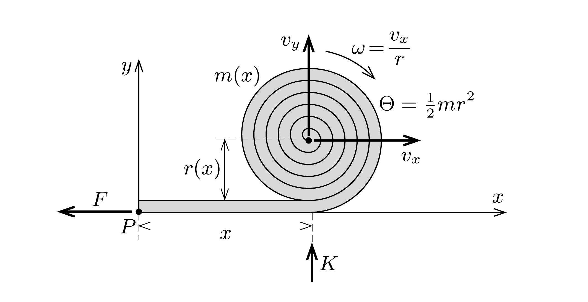

Péter és Pál (két fizikusnak készülő diák) tovább vizsgálta az előzó feladatban szerepló túzoltófecskendőt, tanulmányozni kezdte annak függőleges irányú mozgását is. Továbbra is feltételezték, hogy a kezdeti mozgási energiája elég nagy ahhoz, hogy a gravitáció hatását elhanyagolhassák.

Péter (az energiamegmaradást és az anyagmegmaradást felhasználva) kiszámította, hogy az ábrán látható $x$ út megtétele után mekkora lesz a guriga $m$ tömege,
$r$ sugara, $\omega$ szögsebessége, $\Theta$ tehetetlenségi nyomatéka, középpontjának $v_{x}$ vízszintes sebessége és $v_{y}$ függőleges sebessége. Természetesen mindezek $x$ függvényei, és ezen keresztül az időtől is függő, időben változó mennyiségek.

Kiszámítottam a $v_{x}$ és $v_{y}$ mennyiségeket, majd ezeket a pillanatnyi $m(x)$ tömeggel megszorozva megkaptam a guriga impulzusának $p_{x}$ és $p_{y}$ komponenseit, - állítja Péter - majd ezek idốbeli változási sebességébôl a külső erốket, $F$-et és $K$-t.

Arra is kíváncsi volt, hogy mekkora és milyen gyorsan változik ennek a furcsa rendszernek a perdülete $(N)$, és összhangban van-e ez a változás a külső erők forgatónyomatékával. Mivel a guriga középpontja is és az egész rendszer tömegközéppontja is gyorsul, nem ezekre, hanem egy rögzített $P$ pontra (a fecskendó álló végpontjára) írta fel a perdület és a forgatónyomaték képleteit.

Legnagyobb meglepetésére azt találta, hogy - jóllehet a külső erők forgatónyomatéka nulla, - a perdület nem marad állandó, hanem időben változik! Mármár arra hajlott, hogy kimondja: ebben a rendszerben nem érvényes a klasszikus mechanika egyik alaptörvénye, a perdületváltozásra vonatkozó összefüggés (perdülettétel).

Pálnak más volt a véleménye! Szerinte Péter valamit rosszul számolt, olyan (megszokott) összefüggést alkalmazott, amit nem lett volna szabad.

Vajon kinek van igaza?
