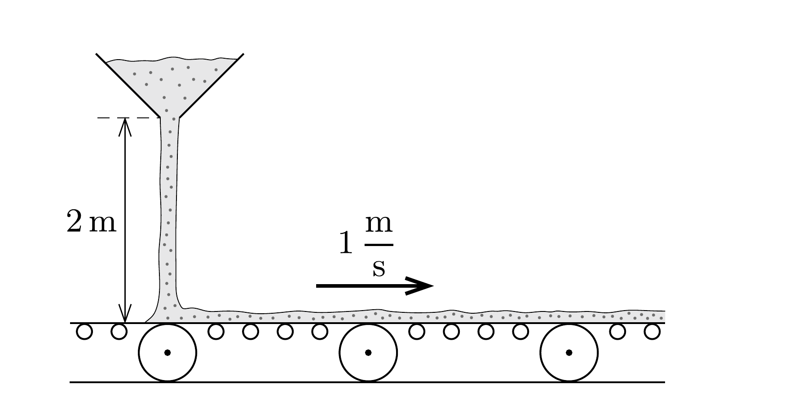

Egy vízszintes, 1 m/s sebességú szállítószalagra függőlegesen, 2 méter magasságból másodpercenként 50 kg homok esik. Legalább mekkora a futószalag motorjának teljesítménye? Mire fordítódik a motor által végzett munka?

