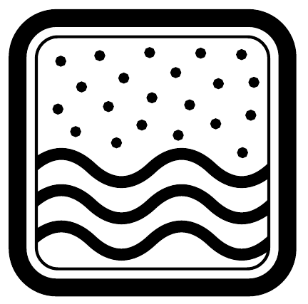

Egy henger alakú zárt tartály fekvő helyzetben egyenletesen forog (vízszintes) hossztengelye körül, $0,5 \mathrm{~s}^{-1}$ fordulatszámmal. A tartály 100 kg homokot tartalmaz, belső átmérője és hossza egyaránt 1 méter, fala érdes. Becsüljük meg, mennyivel növekszik a homok hőmérséklete 10 perc alatt, ha a falon keresztül történő hőleadást elhanyagoljuk!

\section*{Folyadékok és gázok mechanikája}
