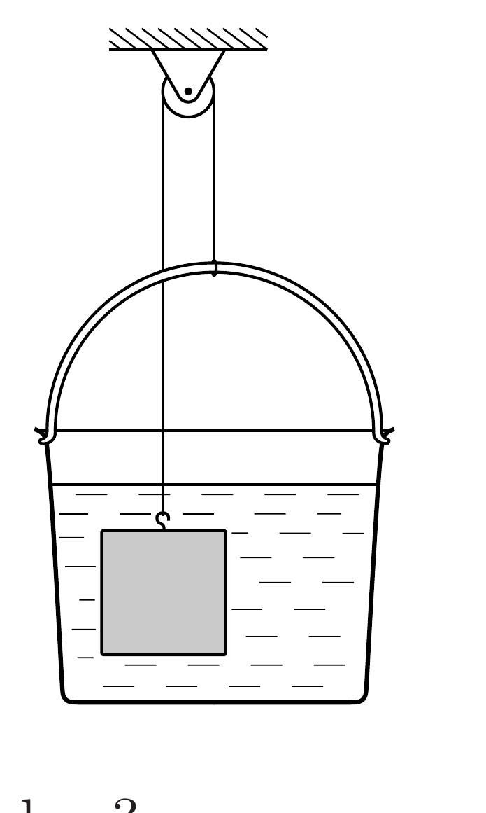

Egy zsineg egyik végéhez egy $1 \mathrm{dm}^{3}$-es vaskockát, a másik végéhez pedig egy vízzel megtöltött, könnyú múanyag vödröt kötünk. A zsineget egy csigán átvetjük, és a vaskockát az ábrán látható módon a vízbe lógatjuk. A rendszer ekkor egyensúlyban van.

- a) Hány liter víz van a vödörben?
- b) Mi történik, ha egy kevés vizet öntünk még a vödörbe?
- c) Mi történik, ha egy kevés víz elpárolog a vödörből?
