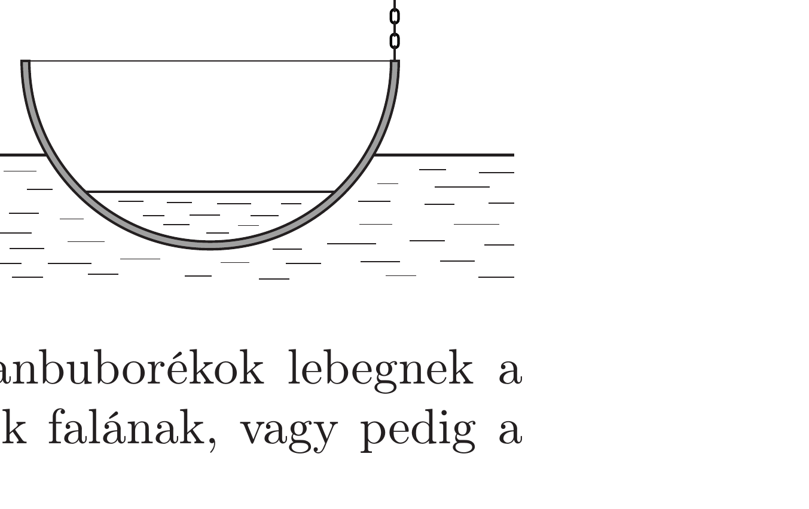

Egy 40 cm átmérójú, félgömb alakú rézüstben halászlevet főztünk. Hütés céljából az üstöt egy tó vizére tesszük. Az üst úszik a vízen, 10 cm mélyre merül. Az üst peremének egyik pontját a hozzá erősített lánc segítségével óvatosan 10 cm-rel magasabbra emeljük. Befolyik-e a víz az üstbe?

