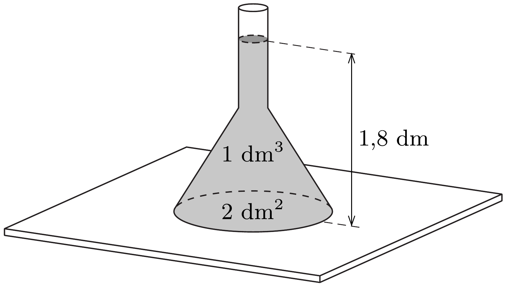

Egy tölcsérbe az ábra szerinti helyzetben $1 \mathrm{dm}^{3}$ vizet töltünk. Az asztalon a tölcsér által letakart terület $2 \mathrm{dm}^{2}$, a víz magassága 1,8 dm.

Legalább mekkora legyen a tölcsér tömege, hogy ne emelkedjen fel az alátámasztási felületről?
