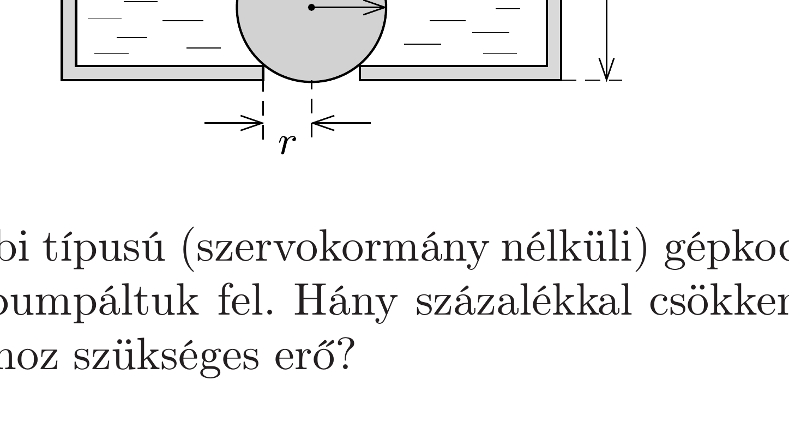

Egy edény alján kör alakú, $r$ sugarú nyílás van, rajta egy $R$ sugarú, elhanyagolható tömegú pingponglabda. Ha az edényben elegendően sok víz van, a labda az edény alján marad. Óvatosan csökkentve a víz mennyiségét, egy bizonyos $h_{0}$ vízmagasságnál a labda felemelkedik. Számítsuk ki $h_{0}$-t!

