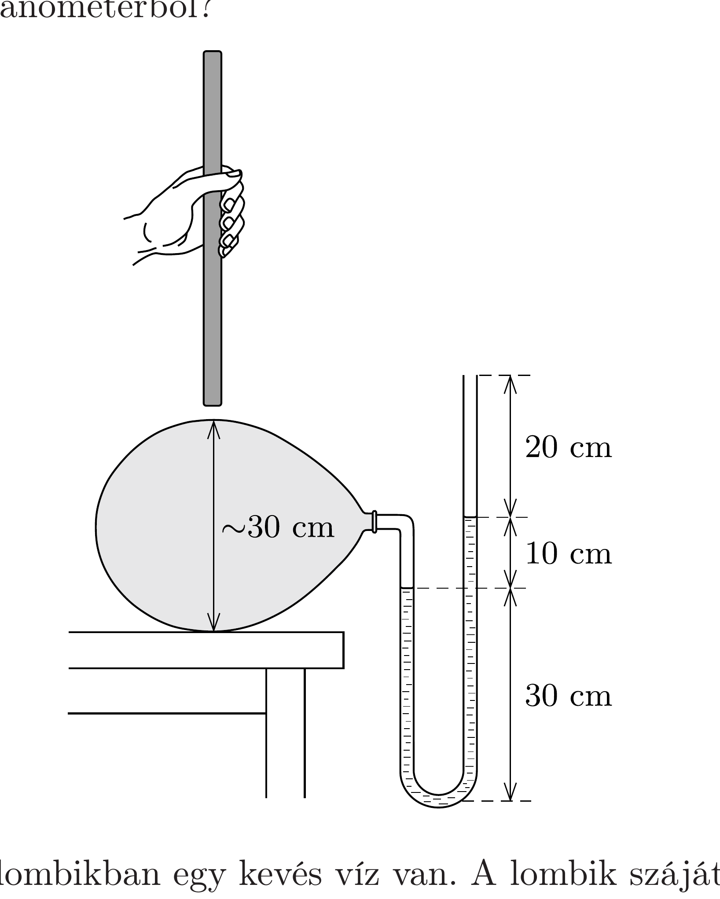

Egy lufit felfújunk, majd az ábrán látható vizes manométerhez csatlakoztatjuk. A manométer 10 cm-es víznyomást mutat. Ezután óvatosan egy 2 cm vastag, 50 cm hosszú, függőleges vasrudat engedünk a lufi tetejére. Vajon ki fog csordulni a víz a manométerből?

