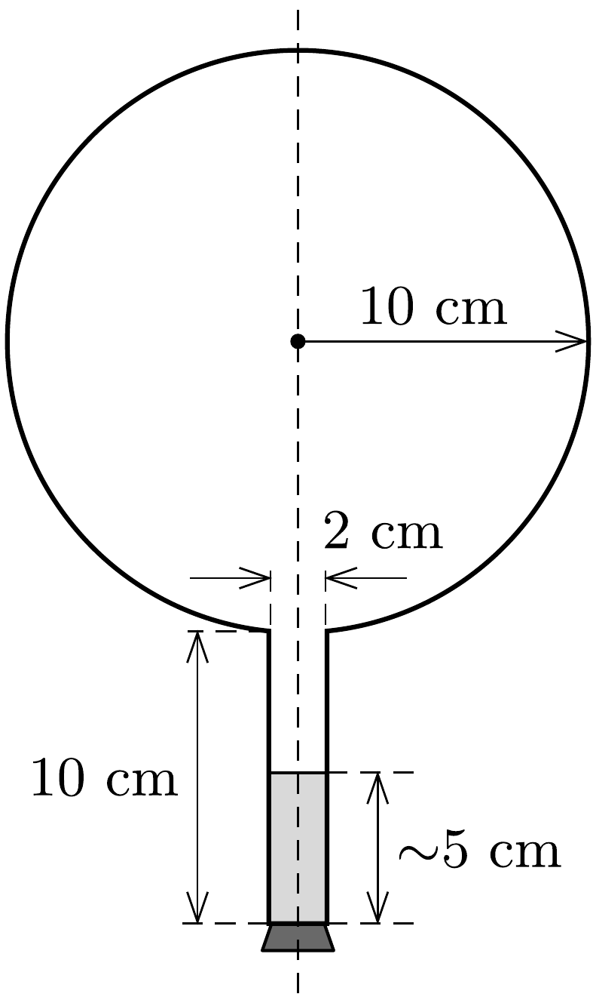

Zárt lombikban egy kevés víz van. A lombik száját lefelé fordítva a víz kb. 5 cm magasan áll a lombik nyakában. (A belső méreteket az ábra mutatja.)

Ezután a lombikot függőleges szimmetriatengelye körül egyenletes forgásba hozzuk úgy, hogy másodpercenként hármat forduljon. Gondoskodunk róla, hogy a lombik falának hőmérséklete mindenütt ugyanakkora legyen. Kellően hosszú idő után egyensúly áll be.

Rajzoljuk fel vázlatosan, hogyan helyezkedik el ekkor a víz a lombikban!
