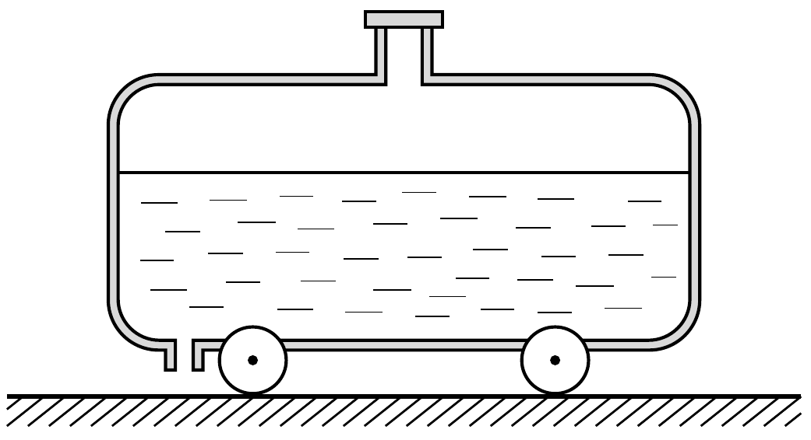

Egy folyadékkal teli tartálykocsi vízszintes úton áll. A kocsit nem fékezték be, és feltételezhetjük, hogy súrlódásmentesen képes mozogni.

Melyik irányba fog megindulni a tartálykocsi, ha a bal oldali végének közelében lévó függőleges leeresztőcsapot megnyitjuk? Vajon a továbbiakban is ugyanarra fog mozogni?
