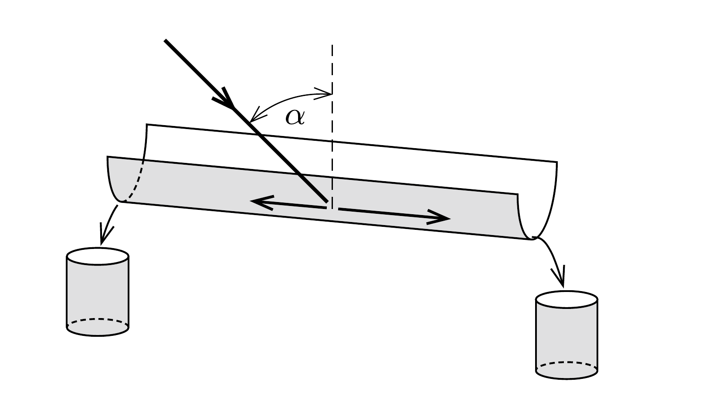

Vízszintesen álló, félkör keresztmetszetú csatornába (a legmélyebben fekvő alkotóján átmenó függőleges síkban) ferdén vízsugár csapódik be. Számítsuk ki a csatorna két végén kifolyó vízmennyiség arányát a vízsugár beesési szögének függvényében! (Az áramló víz belső súrlódása az adott körülmények között nem számottevő.)

