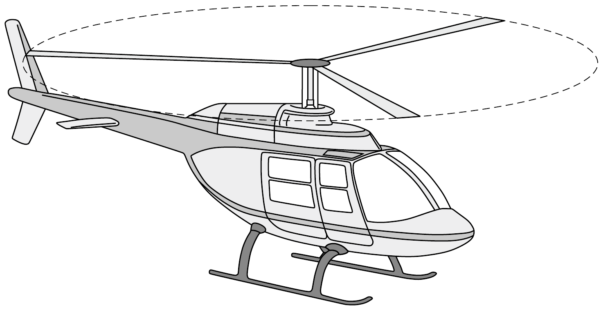
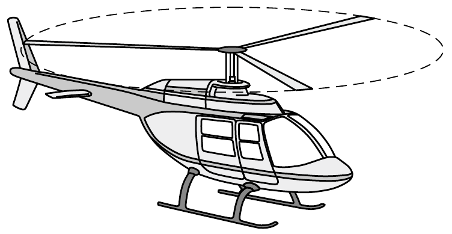

Egy bizonyos helikopter akkor tud egy helyben lebegni, ha motorja $P$ mechanikai teljesítményt ad le. Egy másik helikopter ennek pontosan felére kicsinyített mása (minden lineáris mérete feleakkora). Mekkora $P^{\prime}$ mechanikai teljesítmény szükséges ahhoz, hogy ez a helikopter lebegjen?

\section*{Felületi feszültség}
