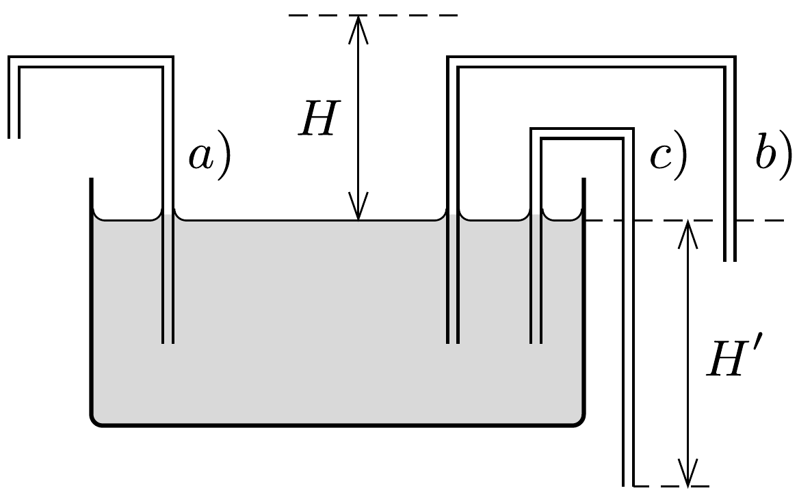

Egy kapilláris csőben (melynek falát jól nedvesíti a víz) $H$ magasságig emelkedik fel a folyadék. A csőből az ábrán látható módon három „akasztófát” készítünk, és egy vízzel telt nagy tálba helyezzük azokat. Kifolyik-e a víz a kapillárisok másik végén? $\left(H^{\prime}>H.\right)$

