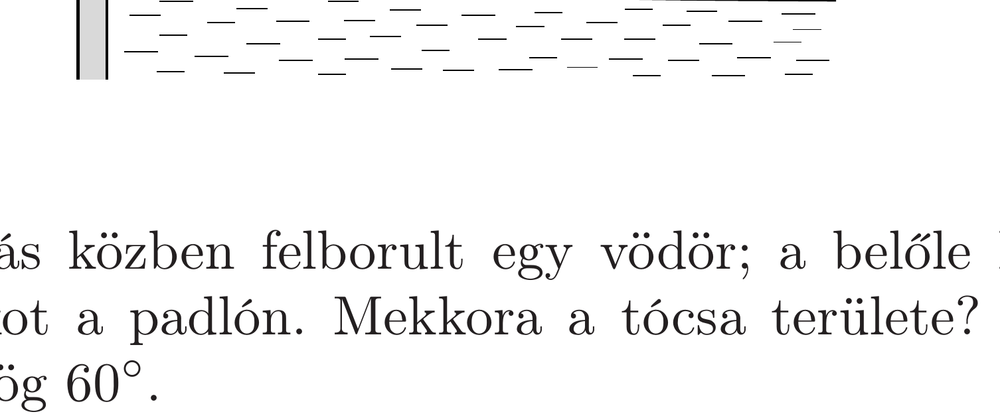

Egy akváriumban - melynek fala tiszta, zsírmentes - víz van. Az akvárium sík üvegfala mentén egy kicsit „felkúszik” a víz. Számítsuk ki az ábrán látható $h$ emelkedési magasságot a víz $\alpha$ felületi feszültségének segítségével! (Feltehetjük, hogy a víz tökéletesen nedvesíti az üveget.)

