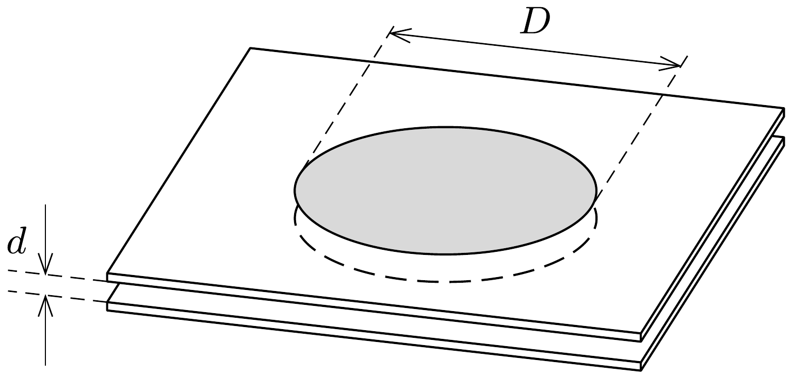

Két párhuzamos üveglemez közé víz szorult. A lemezek távolsága $d$, a „vízpogácsa" átméróje $D \gg d$. Mekkora erő hat az üveglemezek között? (Feltételezhetjük, hogy a víz tökéletesen nedvesíti az üveget.)

