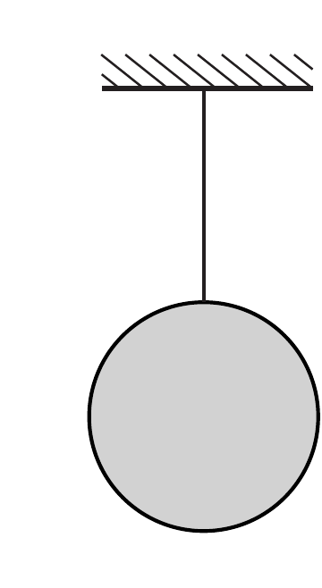
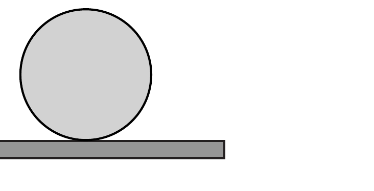

Két egyforma fémgömbbel ugyanakkora hốt közlünk. Az egyik $(a)$ gömb hőszigetelő fonálon függ, a másik $(b)$ hőszigetelő lapon nyugszik.

Két diák azon vitatkozik, hogy vajon melyik gömb hőmérséklete lesz magasabb a hőközlés után? Abban egyetértenek, hogy a fonálon függő gömb tömegközéppontja a hőtágulás miatt alacsonyabbra, a másik gömbé pedig magasabbra kerül. János szerint, ha az egyforma gömbök belső energiája ugyanakkora mértékben növekedne, akkor a hőmérsékletük is ugyanannyival emelkedne. A gravitációs helyzeti energiák megváltozása miatt viszont az $a$ ) esetben a közölt hőnél több, a $b$ ) esetben pedig kevesebb jut a belső energia növelésére, így a fonálon függő gömb hőmérséklete jobban emelkedik, mint az asztalon állóé - érvel János.

Tamás kételkedik ebben. Szerinte a gravitációs helyzeti energia megváltozása a belső energia változásához képest olyan kicsiny, hogy ha mégis figyelembe vesszük, akkor egyéb - hasonló nagyságrendú - hatásokat is számításba kellene vennünk. Sajnos ezt - megfelelő „fizikusi ismeretek” hiányában - Tamás nem tudja megtenni, de úgy látja, hogy János érvelése ellentmond a hótan II. főtételének, tehát nem lehet helyes.

Melyiküknek van igaza?
