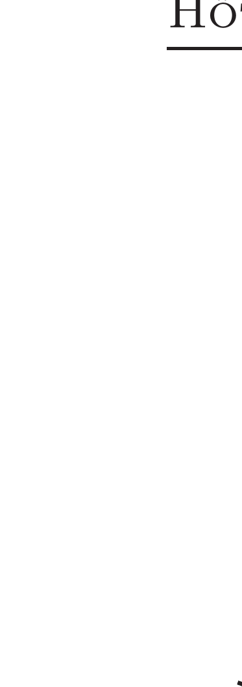

Egy fúthető kemencén nagyon kis lyuk van (egyébként a kemence zárt). A kemencén kívül 0 °C hőmérsékletú, 100 kPa nyomású levegő van. A kemencében lévő levegőt a fútórendszer állandóan 57 °C hőmérsékleten tartja. Kellő idő elteltével a kemencében a levegő nyomása állandósul. Adjunk becslést ennek az állandósult nyomásnak a nagyságára!

