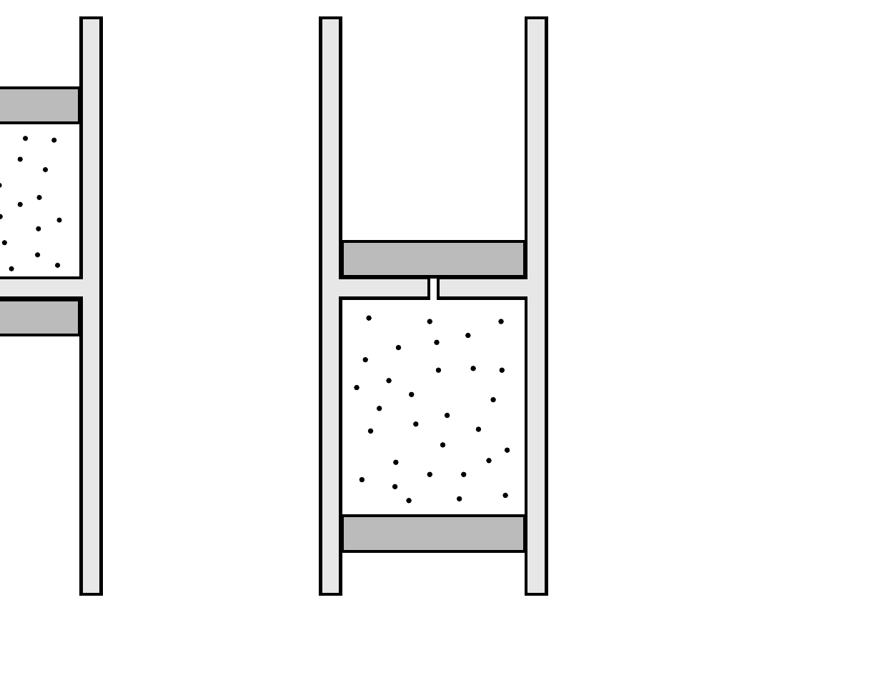

Függőleges tengelyú, mindkét végén nyitott, rögzített, hosszú henger ideálisnak tekinthető gázt tartalmaz. A gázt két egyforma, súrlódásmentesen mozgó dugattyú zárja el környezetétől. A dugattyúk között egy rögzített, érdes válaszfal található, amelyen kis lyuk van. Kezdetben a bezárt gáz hómérséklete megegyezik a külső levegő hőmérsékletével, az alsó dugattyút pedig a válaszfalnál tartjuk, majd elengedjük. Ekkor a dugattyúk

lassan leereszkednek.

A végállapotban melyik esetben kerül mélyebbre az alsó dugattyú:
- a) ha a dugattyúk, a válaszfal és a henger fala is jó hőszigetelő, vagy
- b) ha a dugattyúk, a válaszfal és a henger fala is jó hóvezető?
