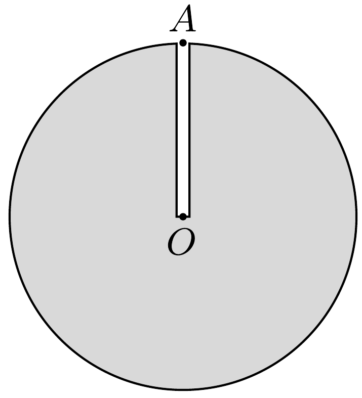
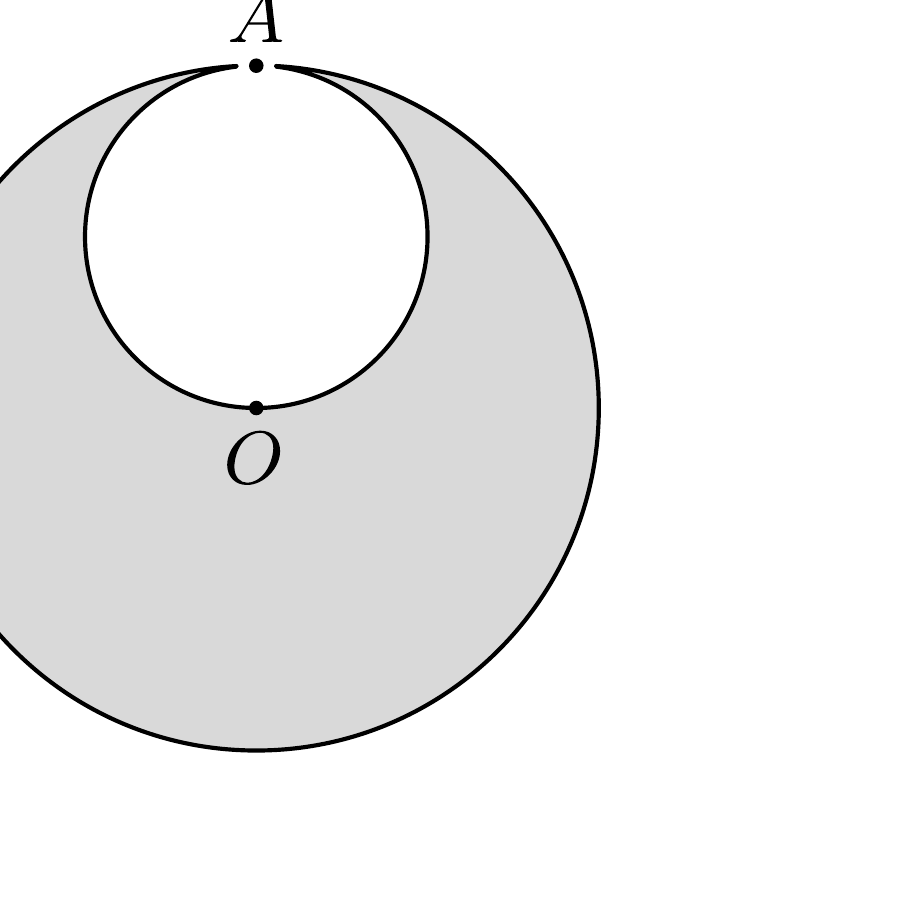

A titánfaló kicsi zöld emberkék egyik kutató ürhajója rátalált egy tökéletesen gömb alakú, $R$ sugarú kisbolygóra. Az ábrán látható $A$ pontból keskeny próbafuratot készítettek, amely eljutott a kisbolygó $O$ középpontjáig. Így megállapították, hogy a bolygót teljes egészében homogén titán alkotja. ${ }^{3}$ Méréseik szerint a keskeny furat belsejében a hőmérséklet mindenhol ugyanakkora, $T_{0}$

\footnotetext{
${ }^{3}$ Ez a leírás egy KOBALKIVI-jelentésből származik, amely két olyan balesettel foglalkozik, melyek a bolygó feltárása és a titán kitermelése közben történtek (lásd az 56. feladatot).

értékú. A bolygó légkörrel rendelkezik, „levegőjének” moláris tömege $M$, a légköri nyomás a felszínen $p_{A}$.
- a) Mekkora a légnyomás a furat alján?

A bolygó anyagának feltárása után a munka folytatódott, a kicsi zöld emberkék megkezdték a titán titkos kitermelését, melynek során a kisbolygó belsejében egy $A O$ átmérőjú, gömb alakú üreget hoztak létre, amint ezt az ábra mutatja. A kitermelt titánt teherűrhajókkal elszállították. A bolygó légköre kitöltötte a létrejött üreget, és ennek hatására az $A$ pontban a nyomás $p_{A}$-ról $p_{A}^{\prime}$-re csökkent.
- b) Feltéve, hogy az üregben a hőmérséklet ugyanakkora maradt, mint amekkora a próbafuratban volt, hogyan változott meg a nyomás az $O$ pontban?

