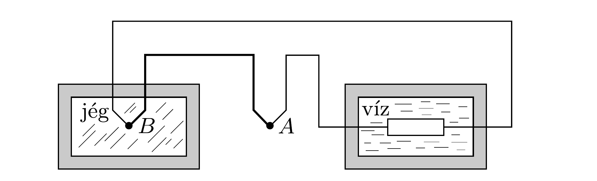

Egy termoelem egyik $(A)$ forrasztása a $T_{A}=27$ °C hőmérsékletú szobában, a másik $(B)$ forrasztás pedig egy hőszigetelt, $T_{B}=0^{\circ} \mathrm{C}$-os jéggel teli edényben van. A termoelem által termelt elektromos energiát egy ellenállás segítségével vízmelegítésre használjuk. A jéggel azonos tömegú víz egy másik, szintén hőszigetelő edényben van. Hány fokkal melegszik fel a víz a jég elolvadásának pillanatáig?

