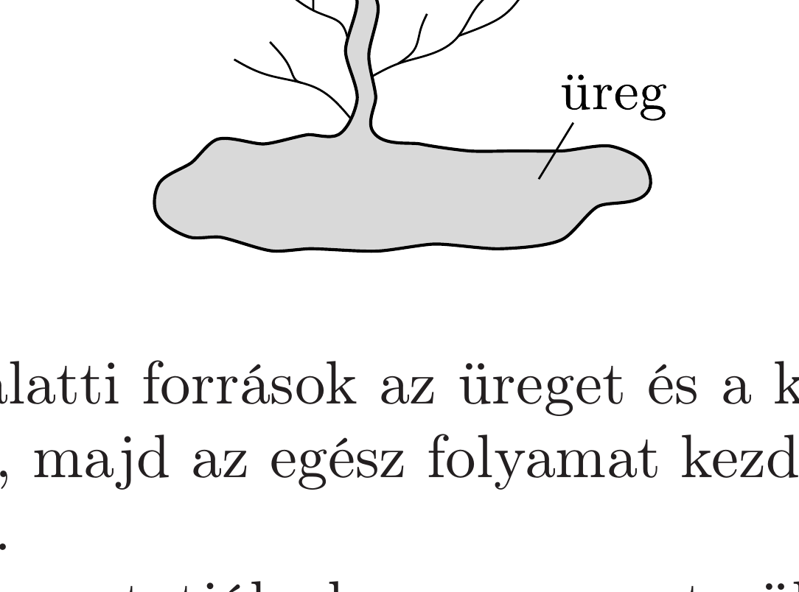

A Yellowstone Nemzeti Park leghíresebb gejzíre az Öreg Húséges (Old Faithful). Ezt a gejzírt egy nagy, föld alatti üregnek tekinthetjük, amely egy keskeny kürtóvel csatlakozik a felszínhez.

A vulkáni utómúködés következtében meleg talaj az üregben lévő vizet felforralja. A forrás megindulása után a kürtőben található víz kilökődik, majd 4 perc alatt hozzávetőlegesen 44 tonna vízgőz szökik ki a gejzírből.

Kitörés után a felszín alatti források az üreget és a kürtőt 20-30 perc alatt a földfelszínig feltöltik vízzel, majd az egész folyamat kezdődik elölről. A kitörések 90 percenként ismétlődnek.

A geológiai fúrások azt mutatják, hogy ezen a területen a földfelszín alatti hőmérséklet lefelé haladva méterenként $1^{\circ} \mathrm{C}$ értékkel emelkedik. Határozzuk meg, hogy minimálisan milyen mélyen van az üreg! Ha feltesszük, hogy az üreg a minimális mélységben van, mekkora a térfogata?
