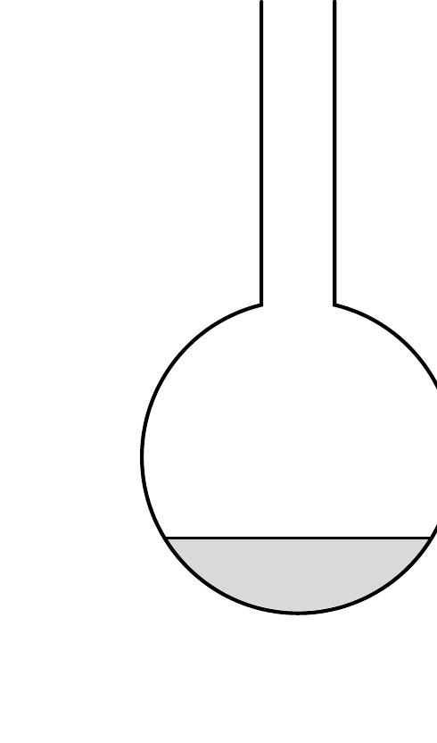
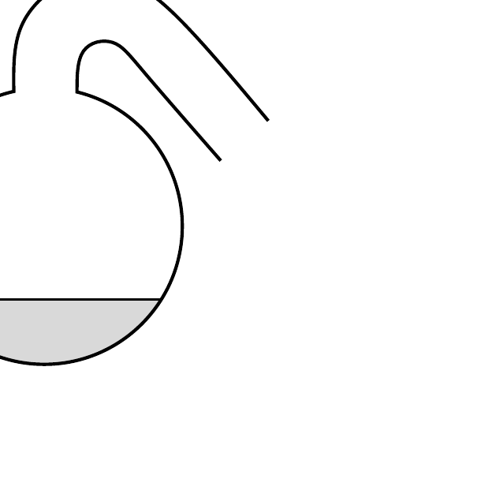

Két, egyébként egyforma lombik közül az egyiknek a nyaka egyenes, a másiké lefelé görbül az ábra szerint. A két lombikba azonos mennyiségú
- a) vizet,
- b) étert

töltünk, és gondoskodunk róla, hogy mindkét lombikban a folyadék hőmérséklete az a) esetben $100^{\circ} \mathrm{C}$,
- a b) esetben 34,6 °C

legyen. Melyik lombikból fogy el hamarabb a folyadék az egyik, illetve a másik esetben?

