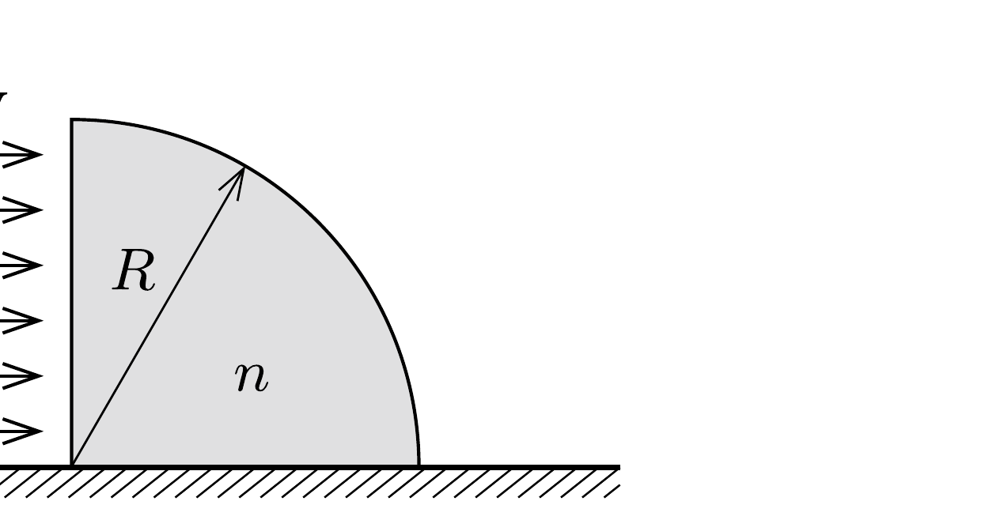

Vízszintes asztallapra fektetünk egy negyedhenger alakú üvegtömböt, amelynek függőlegesen álló síklapját rá merőleges, egyenletes fénynyalábbal világítjuk meg. Hol tapasztalhatunk a henger után az asztallapon fényfoltot, ha a henger sugara $R=5 \mathrm{~cm}$, anyagának törésmutatója

$n=1,5$ ?
