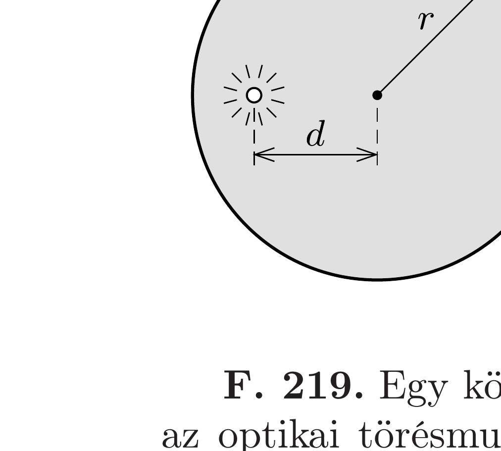

Milyen alakú annak az üvegrúdnak a legömbölyített vége, amely minden, a rúd tengelyével párhuzamosan a legömbölyített felületre érkező fénysugarat az üveg belsejében egyetlen pontba fókuszál? Adjuk meg a felület alakját jellemző görbe egyenletét az $n$ törésmutató és a rúd végétől számított $f$ fókusztávolság függvényében!

Milyen alakú az üvegrúd végének felülete akkor, ha a rúd tengelyével párhuzamos fénysugarak az üvegben haladnak, majd a rúdon kívül fókuszálódnak a szimmetriatengelyen lévő fókuszpontba?

