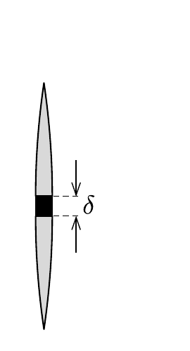

${ }^{*}$ Egy $f$ fókusztávolságú gyújtőlencsét az optikai tengelyét tartalmazó síkkal kettévágunk, majd a két féllencse közé egy kicsiny $\delta$ vastagságú, fekete lemezkét toldunk be. A lencsétől $t>f$ távolságra (az „optikai tengelyre”) egy monokromatikus, $\lambda$ hullámhosszúságú, pontszerú fényforrást helyezünk.

Hány interferenciacsíkot láthatunk a lencse túloldalán $H$ távolságra elhelyezett, az optikai tengelyre merőleges síkú ernyőn? (Adatok: $f=10 \mathrm{~cm}, t=20 \mathrm{~cm}, \delta=1 \mathrm{~mm}, \lambda=0,5 \mu \mathrm{~m}, H=50 \mathrm{~cm}$.)

