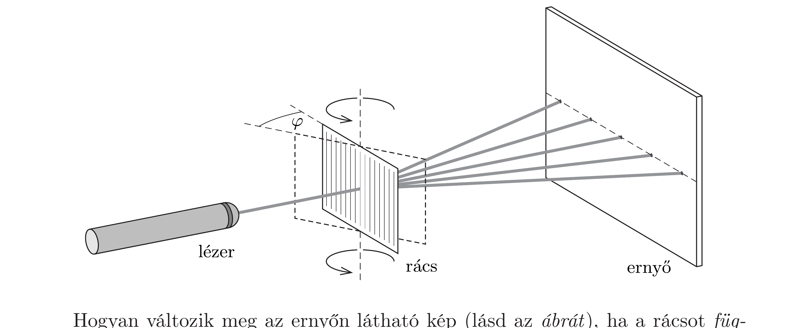

Vízszintesen haladó, keskeny, $\lambda$ hullámhosszúságú lézernyalábbal világítunk meg egy - a lézerfény irányára merőlegesen álló - optikai rácsot, amelynek $d$ távolságú rései függőlegesek. A rácstól viszonylag messze, a beesó lézerfény irányára merőlegesen elhelyezett ernyőn kialakuló elhajlási kép - mint az jól ismert vízszintes egyenesen elhelyezkedő „pontsorból” (valójában fényfoltokból) áll.

Hogyan változik meg az ernyőn látható kép (lásd az ábrát), ha a rácsot függőleges középvonala körül $\varphi$ szöggel elforgatjuk? Vizsgáljuk meg részletesebben a „nagyon lapos beesés" (vagyis a $\varphi \approx 90^{\circ}$ ) határesetet! Mekkora rácsállandó esetén kaphatunk jól megfigyelhető interferenciaképet?
