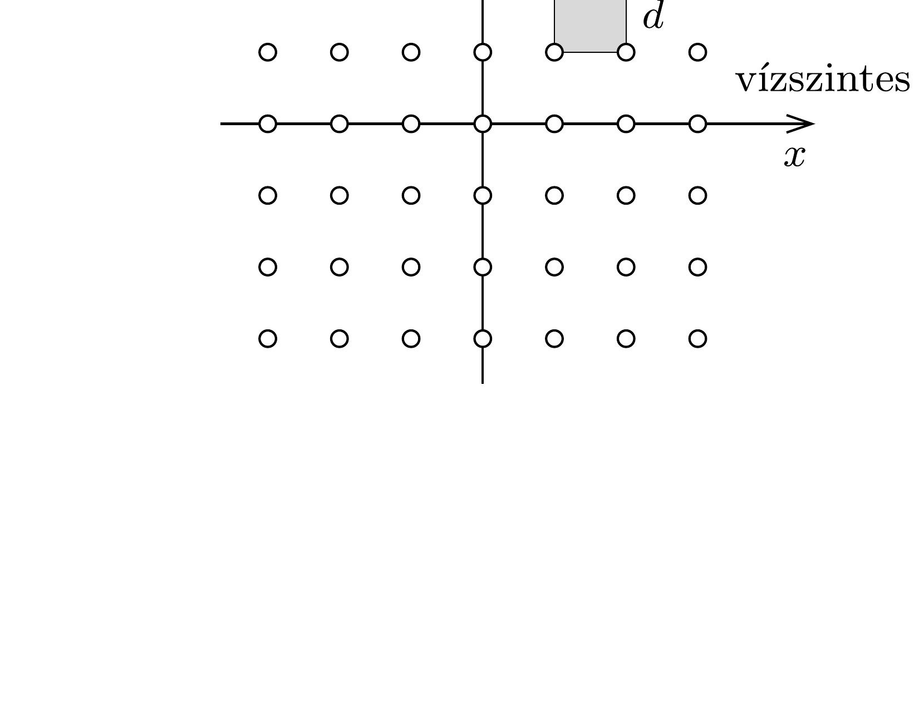

Egy átlátszatlan lapon kicsiny

lyukak vannak az ábrán látható négyzetrács elrendezésben. A lapot monokromatikus, $\lambda$ hullámhosszúságú lézerfénnyel világítjuk meg merőlegesen. Milyen elhajlási képet figyelhetünk meg a rácstól $L$ távolságra elhelyezett ernyőn, ha a rácsállandó $d$ ? (Feltételezhetjük, hogy $L \gg d \gg \lambda$.)

Hogyan változik az interferenciakép, ha a lapot a négyzet egyik oldala mentén $N$ szeresére zsugorítjuk, és így a rajta lévő lyukak elrendeződése „téglalaprács” lesz?
