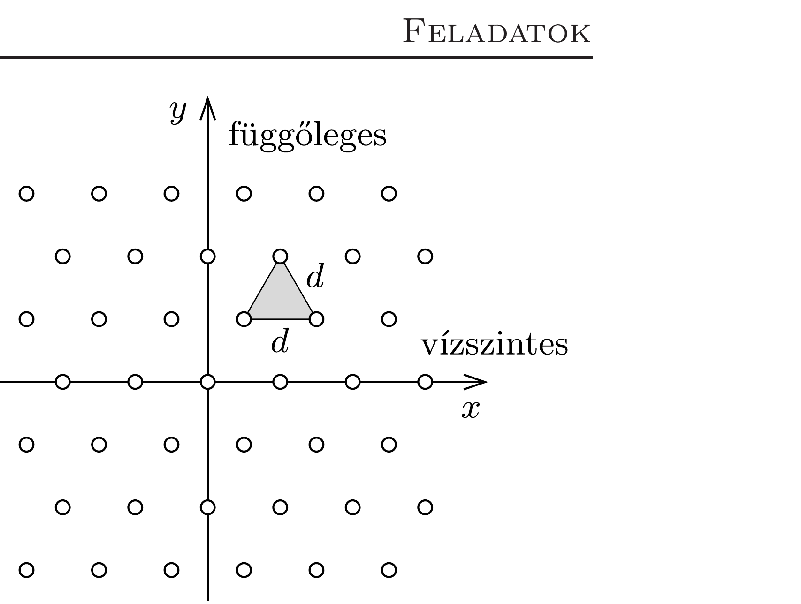

Egy átlátszatlan lapon kicsiny lyukak vannak az ábrán látható háromszögrács elrendezésben. A lapot monokromatikus, $\lambda$ hullámhosszúságú lézerfénnyel világítjuk meg merólegesen. Milyen elhajlási képet figyelhetünk meg a rácstól $L$ távolságra elhelyezett ernyőn, ha a rácsállandó $d$ ? (Feltételezhetjük, hogy $L \gg d \gg \lambda$.)

