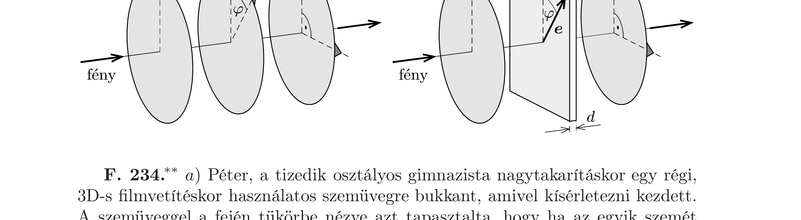

a) Keresztezett állású polárszúrókön nem jut át a fény. Ha közéjük becsúsztatunk egy harmadik polárszűrót, valamennyi fény átjuthat. A bejövő fény intenzitásának legfeljebb hányadrésze juthat át? Mekkora ebben az esetben az a) ábrán látható $\varphi$ szög?
b) Úgy is átjuthat fény a keresztezett állású polárszűrőkön, ha közéjük a b) ábrán látható módon egy velük párhuzamos, kettőstörő anyagból készült plánparalel lemezt helyezünk. Ennek a lemeznek az a speciális tulajdonsága, hogy törésmutatója a síkjában fekvő $\boldsymbol{e}$ iránnyal párhuzamos polarizációjú fényre nézve $n_{1}$, az $e$ irányra meróleges polarizációjú fényre nézve pedig $n_{2}$.

Legfeljebb hányadrésze juthat át a bejövő fény intenzitásának, ha a rendszert (a polárszúrők és a lemez síkjára merőlegesen) $\lambda$ hullámhosszú, monokromatikus fénnyel világítjuk meg? Ebben az esetben mekkorának kell lennie a kettőstörő lemez $d$ vastagságának, és hogyan válasszuk meg az $\boldsymbol{e}$ irányt?

